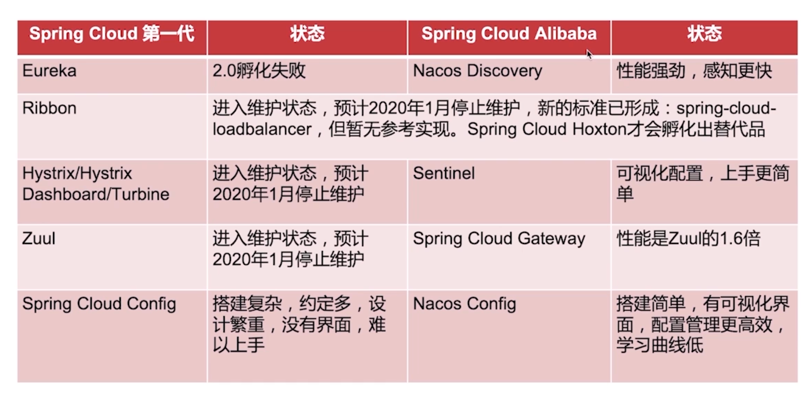
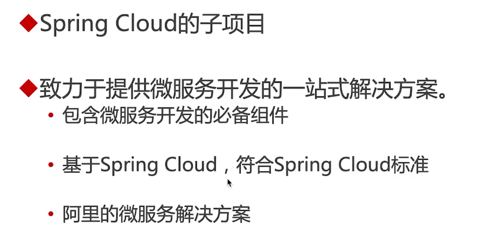
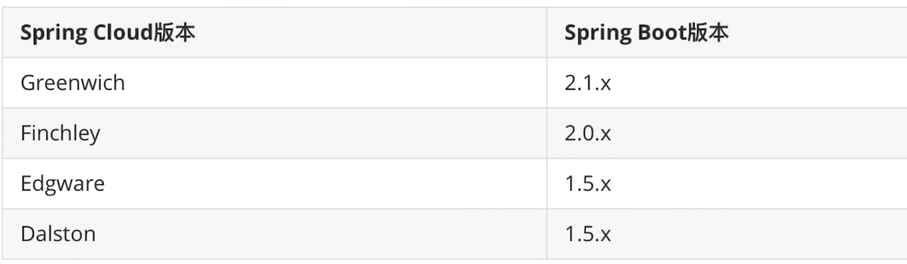
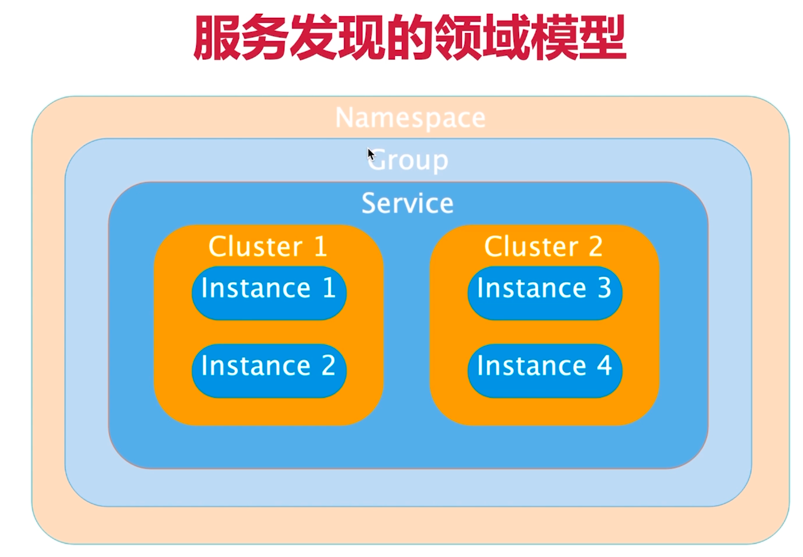
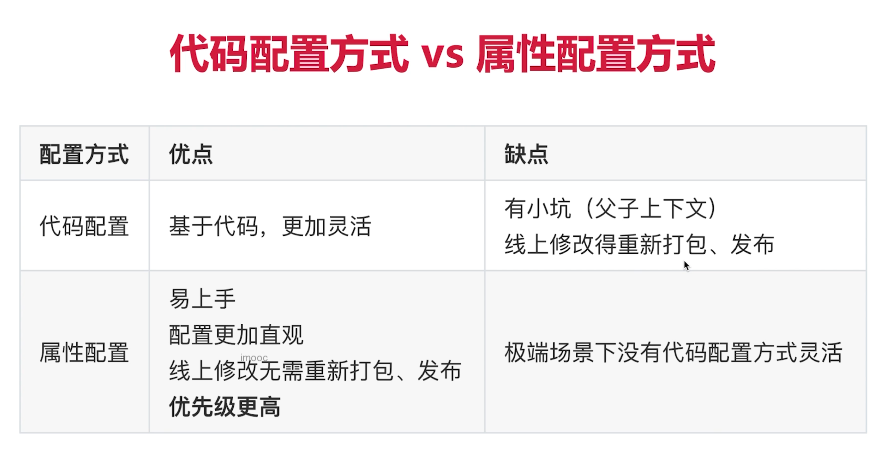

# Spring Cloud 适合场景

大型复杂场景，例如大型电商系统等。

# Spring Cloud 与Spring Cloud Alibaba区别

Spring Cloud Alibaba是Spring Cloud的子项目



总结来说Spring Cloud Alibaba优势

- 组件性能更强
- 良好的可视化界面
- 搭建简单，学习曲线低
- 文档丰富而且是中文

# 什么是SpringCloud Alibaba



# Spring Cloud Alibaba 已包含组件

**Sentinel**

阿里巴巴开源产品，把流量作为切入点，从流量控制、熔断降级、系统负载保护等多个维度保护服务的稳定性。

**Nacos**

阿里巴巴开源产品，一个更易于构建云原生应用的动态服务发现、配置管理和服务管理平台。

**RocketMQ**

Apache RocketMQ™ 基于 Java 的高性能、高吞吐量的分布式消息和流计算平台。

**Dubbo**

Apache Dubbo™ 是一款高性能 Java RPC 框架。

**Seata**

阿里巴巴开源产品，一个易于使用的高性能微服务分布式事务解决方案。

**Alibaba Cloud OSS**

阿里云对象存储服务（Object Storage Service，简称 OSS），是阿里云提供的海量、安全、低成本、高可靠的云存储服务。您可以在任何应用、任何时间、任何地点存储和访问任意类型的数据。

**Alibaba Cloud SchedulerX**

阿里中间件团队开发的一款分布式任务调度产品，支持周期性的任务与固定时间点触发任务。

**Alibaba Cloud SMS**

覆盖全球的短信服务，友好、高效、智能的互联化通讯能力，帮助企业迅速搭建客户触达通道。

# Spring Cloud 版本

版本区别

- SNAPSHOT开发版
- M里程碑版
- RELEASE正式版

已发布版本

- Angel
- Brixton
- Camden
- Dalston
- Edgware
- Finchley
- Greenwich
- Howton

# Spring Cloud与Spring Boot兼容关系



# 服务中心/注册中心

## Nacos

### 什么是Nacos

一个服务发现组件 + 配置服务器

### Nacos访问

http://localhost:8848/nacos

账号：nacos

密码：nacos

### Nacos的领域模型



# 服务调用

## Http调用

### RestTemplate

```java
// getForEntity()和getForObjecet()区别
// Object只返回result，Entity携带请求的状态码和状态信息
```

# 负载均衡

## ribbon

### 代码配置与属性配置的区别


